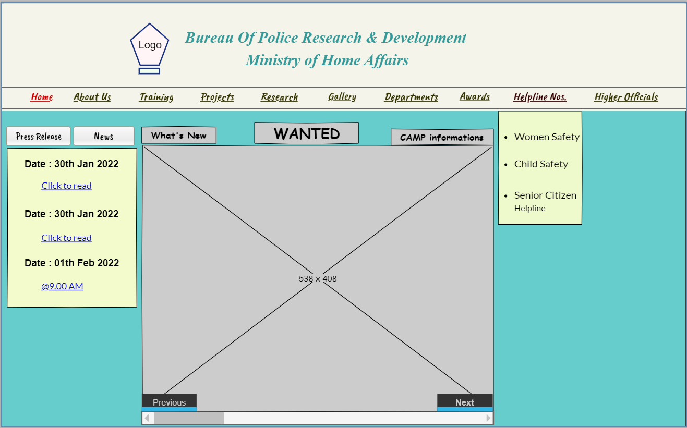
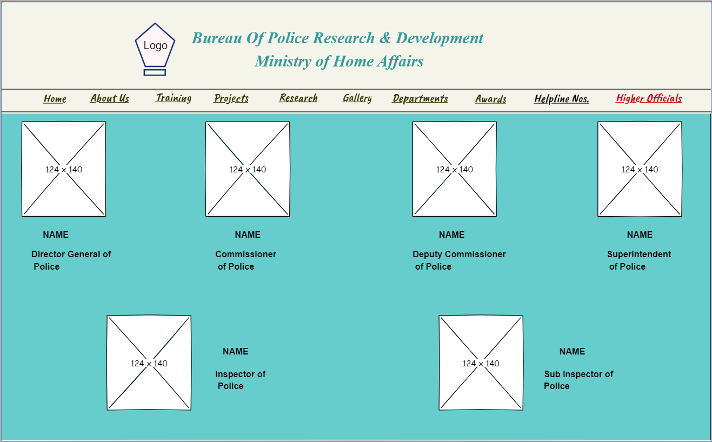
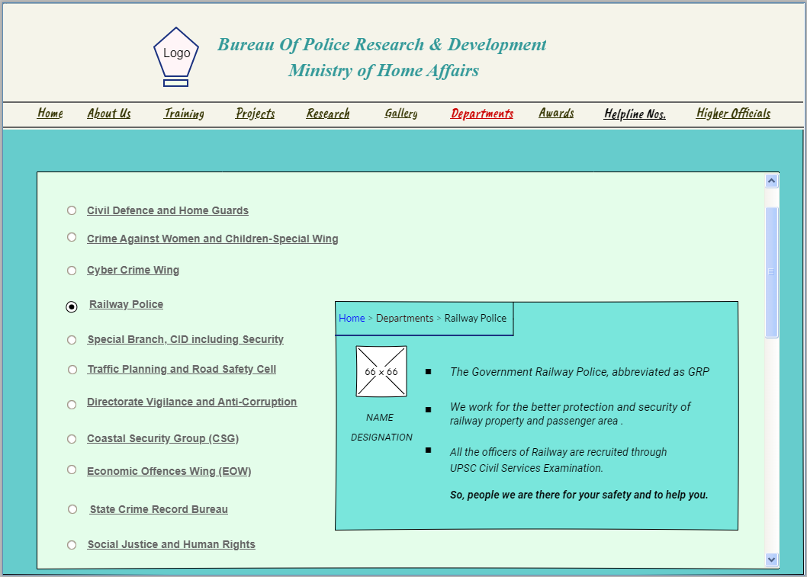
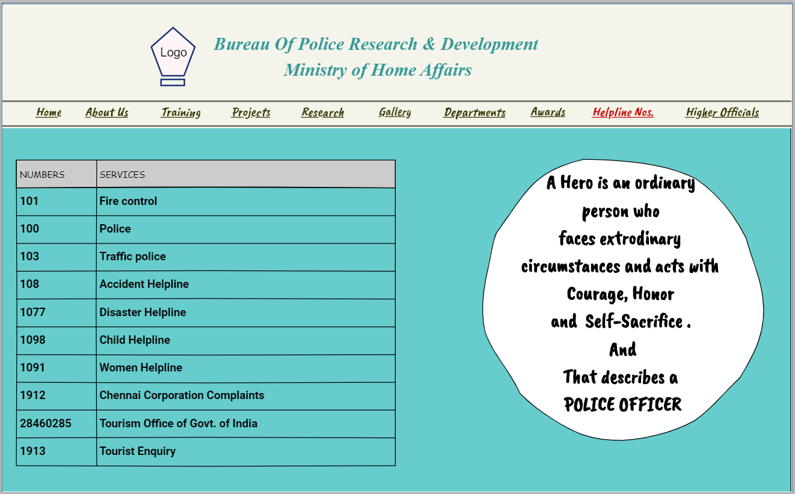

# WIRE FRAME FOR A WEBSITE

## AIM:
To design a wire frame for a website.

## DESIGN STEPS:

### Step 1:
Open a New Document and resize the canvas to your required size.

### Step 2:
Use the tools to design the given website using your creative skills.
### Step 3:
Duplicate tha layout and modify the next pages.
### Step 4:
Save the pages and its done.
## OUTPUT:

## RESULT:
Thus a wire frame is designed for a given website.
